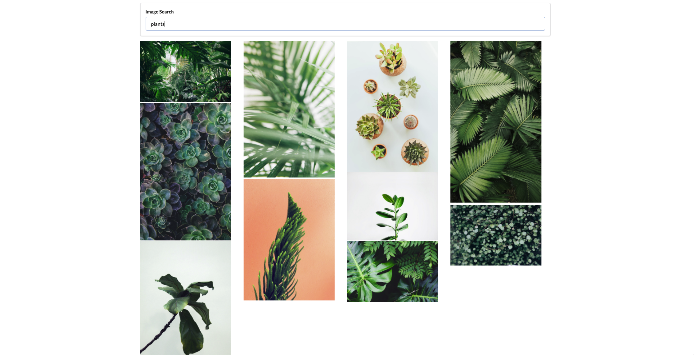

# Pics React App

React app using the [Unsplash API](https://unsplash.com/developers) to search for and display 10 images.

Uses CSS grid and refs on each image component to calculate the height and optimal number of grid spans for a tiled display

Live example here: https://pics-nine.vercel.app

